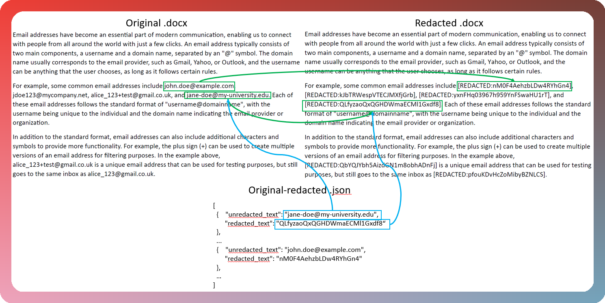

<div align='center'><h1> raf (incomplete) </h1></div>
<div align='center'><i> redact all files!!!<p>(actually only two types of file, lol) </i></div>

<p>

A command line tool, written in Rust, to redact texts in file(s) that match a certain regex.

It is inspired by the following:

1. [PyRedactKit](https://github.com/brootware/PyRedactKit)
2. [py-redact](https://github.com/datumbrain/py-redact)
3. [redact](https://github.com/wils0ns/redact)
4. [go-scrub](https://github.com/ssrathi/go-scrub)


# What it does

# In a Picture


# In Words
1. Given a file in `.txt` and `.docx` and a list of regexes that one wishes to redact, `raf` redacts it with random alphanumeric characters in place of all texts that match any of the regexes.
2. It also provides a mapping in the form of a `.json` file between the original text and the redacted text.

**Disclaimer**:
Sadly, for now, you can only redact `.txt` and `.docx` files.

# Usage

You need to have Rust [installed](https://www.rust-lang.org/tools/install) first.

# Via `Cargo Run`
1. Git clone this repo

```
git clone https://github.com/jymchng/raf.git
```

1. `cargo run` it

Example, to redact all `phone` and `emails` texts for all files in a folder, use:
```
cargo run -- folder ./tests/test_files -t phone emails
```
Note the `folder` subcommand.

Or you can use:
```rust
cargo run -- folder ./tests/test_files -t phone
```
This is because `email` and `emails` are categorized under the list of `types` in the `patterns.json` file, i.e.:

```json
{
    "pattern": "([a-z0-9_+]([a-z0-9_+.\\-]*[a-z0-9_+\\-])?)@([a-z0-9]+([\\-\\.]{1}[a-z0-9]+)*\\.[a-z]{2,6})",
    "type": [
        "email",
        "emails"
    ]
}
```

Currently, only `email` and `phone` are supported.

To redact files in sub-directories of your `folder`, use:
```rust
cargo run -- folder ./tests/test_files -t phone  -r
```
Note the `-r` parameter.

A `.json` file is also provided as a mapping between the redacted text and the original text.

Example:
```
[
  {    "unredacted_text": "jane-doe@my-university.edu",
       "redacted_text": "QLfyzaoQxQGHDWmaECMl1Gxdf8“
  },
  ...
  {    "unredacted_text": "john.doe@example.com", 
       "redacted_text": "nM0F4AehzbLDw4RYhGn4" 
  },
  …
]
```

# Via Installation of the Binary

You can compile and build the binary using:
```
cargo install --git https://github.com/jymchng/raf.git
```

Then use the commands as discussed in the previous section. Example:
```
raf file ./tests/test_files/file1.txt -t phone email
```

# Help
Use the `--help` command to read the `help` section of `raf.

Example:
```
raf folder --help
```